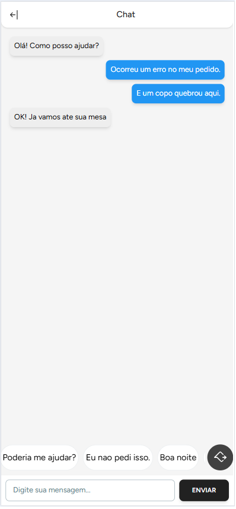

# View IMenu Project

Este repositório contém as telas do **IMenu**, um sistema SaaS para restaurantes. O objetivo é oferecer uma experiência intuitiva para clientes realizarem pedidos diretamente pelo cardápio online, além de facilitar a gestão de pedidos para os restaurantes.

---

## Telas do Sistema

### 1. Tela Inicial

**Descrição:** A tela inicial apresenta uma visão geral para o cliente, permitindo acessar o menu e realizar pedidos.

---

### 2. Escolhendo Produtos

**Descrição:** Interface onde o cliente pode selecionar múltiplos produtos para adicionar ao carrinho.

---

### 3. Menu com Produto Selecionado

**Descrição:** Exibe o menu com os produtos selecionados destacados, facilitando a visualização.

---

### 4. Tela de Confirmação de Pedido

**Descrição:** Mostra o resumo do pedido antes da confirmação, incluindo itens, preços e total.

---

### 5. Tela de Pedidos em Preparação, Prontos e Entregues

**Descrição:** Exibe os pedidos em diferentes estados (em preparação, prontos e entregues).

---

### 6. Tela de Pedidos Entregues

**Descrição:** Mostra todos os pedidos que já foram entregues ao cliente.

---

### 7. Exibindo o Produto

**Descrição:** Detalhes do produto selecionado, incluindo descrição, preço e imagem.

---

### 8. Tela do Chat

**Descrição:** Tela para comunicação direta entre o cliente e o restaurante.

---

### 9. Tela com Pedidos ou Produtos Entregues

**Descrição:** Resumo dos produtos ou pedidos que já foram entregues ao cliente.

---

## Sobre o Projeto

- **Tecnologias Utilizadas:** Laravel, React, Inertia.js, Tailwind CSS.
- **Propósito:** Proporcionar uma solução eficiente para restaurantes gerenciarem seus cardápios e pedidos online.
- **Funcionalidades:**
  - Escolha de produtos diretamente pelo cliente.
  - Resumo e confirmação de pedidos.
  - Gerenciamento do status dos pedidos (em preparação, prontos, entregues).
  - Comunicação via chat entre cliente e restaurante.

---

